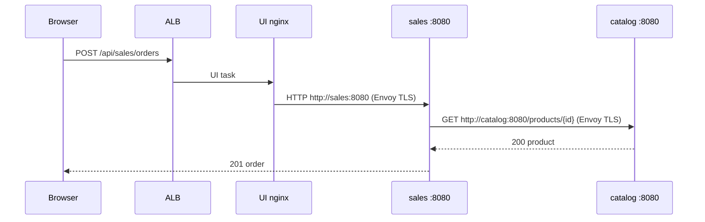

# ALB and ECS Service Connect

How traffic moves in **ecs-sc**: one Fargate cluster, three services (UI, catalog, sales). Each service is one microservice and one container.

| Plane | AWS feature | Direction | What it carries |
| --- | --- | --- | --- |
| **North-south** | Application Load Balancer | Internet → UI | Store SPA, Swagger, same-origin `/api/*` |
| **East-west** | ECS Service Connect with TLS | UI → catalog, UI → sales, sales → catalog | REST between tasks |

The browser never talks to catalog or sales. Catalog and sales are not ALB targets.

```text
Internet
    │  north-south
    ▼
   ALB :80
    │  UI task only (container port 80)
    ▼
┌─────────────────────┐     Service Connect TLS      ┌─────────────────────┐
│ ECS service: UI     │ ── http://catalog:8080 ────► │ ECS service: catalog│
│ client only         │ ── http://sales:8080 ──────► │ server "catalog"    │
│ nginx + SPA :80     │                              │ Node :8080          │
└─────────────────────┘                              └──────────▲──────────┘
                                                                │
                         Service Connect TLS                    │
                         GET /products/:id                      │
┌─────────────────────┐                                         │
│ ECS service: sales  │ ────────────────────────────────────────┘
│ server "sales"      │
│ Node :8080          │
└─────────────────────┘
```

Apps still use **plain HTTP**. The Service Connect Envoy sidecar on each task encrypts the hop (TLS 1.3). Certificates come from an AWS Private CA in short-lived mode.

---

## 1. Cluster, services, tasks

One HTTP namespace: `ecs-sc.local`.

| Service | Role | ALB | Service Connect | App port |
| --- | --- | --- | --- | --- |
| `ecs-sc-dev-ui` | Browser entry | Yes — container `ui` `:80` | Client only (no `service {}` block) | 80 |
| `ecs-sc-dev-catalog` | Product catalog | No | Server `catalog:8080` → `catalog-http` `:8080`, **TLS on** | 8080 |
| `ecs-sc-dev-sales` | Prices and orders | No | Server `sales:8080` → `sales-http` `:8080`, **TLS on** | 8080 |

Every task is Fargate `awsvpc` (one ENI) plus the Envoy sidecar ECS injects.

Terraform for a server (catalog / sales):

```hcl
service_connect_configuration {
  enabled   = true
  namespace = module.ecs_cluster.namespace_arn

  service {
    port_name      = "catalog-http"   # matches container portMapping name
    discovery_name = "catalog"
    client_alias {
      dns_name = "catalog"
      port     = 8080                 # what callers use
    }
    tls {
      role_arn = ...                  # ECS infrastructure role
      kms_key  = ...
      issuer_cert_authority {
        aws_pca_authority_arn = ...   # short-lived Private CA
      }
    }
  }
}
```

UI enables Service Connect with **no** `service` block, so it can call `catalog` and `sales` but is not itself a discovery name.

---

## 2. North-south: ALB → UI

```text
Browser  →  ALB :80  →  UI task nginx :80
                         /              → React SPA
                         /health        → 200 (ALB health check)
                         /swagger/      → OpenAPI UI
                         /api/catalog/* → http://catalog:8080/   (leaves this task)
                         /api/sales/*   → http://sales:8080/     (leaves this task)
```

| ALB piece | Value |
| --- | --- |
| Target group | `ecs-sc-dev-ui`, `target_type = ip` |
| Target | UI task, container `ui`, port `80` |
| Health check | `GET /health` → `200` |

Catalog and sales have no `load_balancer` block. ALB security-group egress is only UI `:80`.

The React app uses same-origin `fetch("/api/catalog/products")`. Nginx is where that becomes an east-west Service Connect call.

---

## 3. East-west: Service Connect

Cloud Map HTTP namespace `ecs-sc.local`. Names such as `catalog` and `sales` are written into `/etc/hosts` on the task and point at **local Envoy**, not VPC DNS.

UI nginx must use a **static** `proxy_pass` after `envsubst`:

```nginx
location /api/catalog/ {
    proxy_pass http://catalog:8080/;
}
location /api/sales/ {
    proxy_pass http://sales:8080/;
}
```

Do **not** add `resolver 10.0.0.2` (or any VPC DNS resolver). That would skip `/etc/hosts` and the call would never reach Envoy.

Sales calls catalog the same way (no nginx): `CATALOG_BASE_URL=http://catalog:8080`.

### TLS

- Configured on the **server** services (catalog, sales).
- Clients in the namespace (UI, and sales calling catalog) use TLS automatically through Envoy.
- Application code does not load certificates.
- Short-lived CA: certificates last seven days and rotate about every five days. Tag the CA `AmazonECSManaged = true`.

```text
UI nginx  --HTTP-->  UI Envoy  --TLS 1.3-->  catalog Envoy  --HTTP-->  catalog :8080
```

---

## 4. Security groups

```text
Internet :80/:443  →  ALB SG  →  UI SG :80
UI SG :8080        →  backend SG          (UI Envoy → catalog / sales)
backend SG :8080   →  backend SG          (sales Envoy → catalog)
```

All tasks also allow egress `:443` for ECR, CloudWatch, Private CA, and Secrets Manager (TLS private keys).

---

## 5. Full hop list (buy a product)

```text
Browser POST http://<alb>/api/sales/orders
  → ALB :80
  → UI nginx :80
  → Service Connect http://sales:8080/orders     # UI → sales (TLS between Envoys)
  → sales app :8080
  → Service Connect http://catalog:8080/products/{id}   # sales → catalog
  → catalog app :8080
  → sales decrements stock, returns 201
```



Select-product uses two UI-originated hops instead: `GET /api/catalog/products/{id}` and `GET /api/sales/prices/{id}`.

---

## 6. What talks to what

| From | To | Mechanism |
| --- | --- | --- |
| Browser | UI `:80` | ALB |
| UI nginx | catalog `:8080` | Service Connect `http://catalog:8080` |
| UI nginx | sales `:8080` | Service Connect `http://sales:8080` |
| sales | catalog `:8080` | Service Connect `http://catalog:8080` |
| ALB | catalog / sales | **Never** |

REST shapes: [openapi.yaml](openapi.yaml). Swagger (via ALB): `/swagger/`.

---

## 7. Local vs AWS

`docker-compose.yml` uses Docker DNS aliases `catalog` and `sales`. That stands in for Service Connect. There is no Envoy and no TLS locally. The hostnames and HTTP paths match AWS so nginx and `CATALOG_BASE_URL` stay the same.

| Concern | Files |
| --- | --- |
| Three services, ALB on UI only | `terraform/main.tf` |
| Service Connect + TLS block | `terraform/modules/ecs_service` |
| SG ALB→UI vs UI→backend vs sales→catalog | `terraform/modules/security_groups` |
| UI proxy | `apps/ui/default.conf.template` |
| sales → catalog | `apps/sales` `CATALOG_BASE_URL` |
